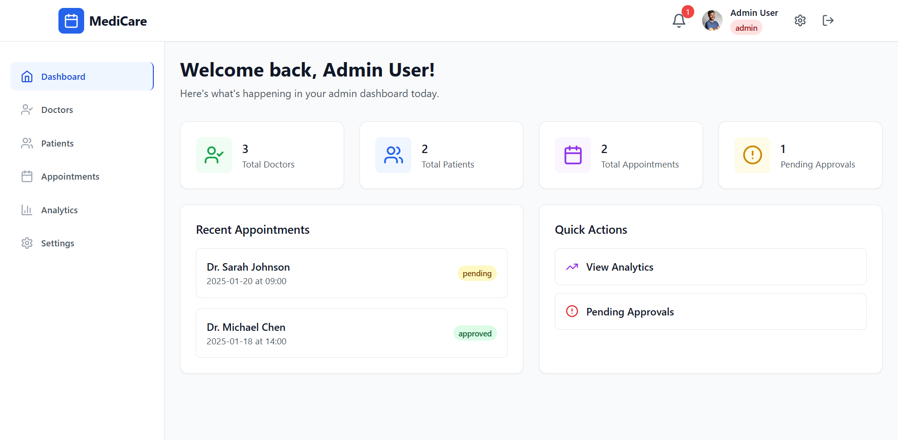
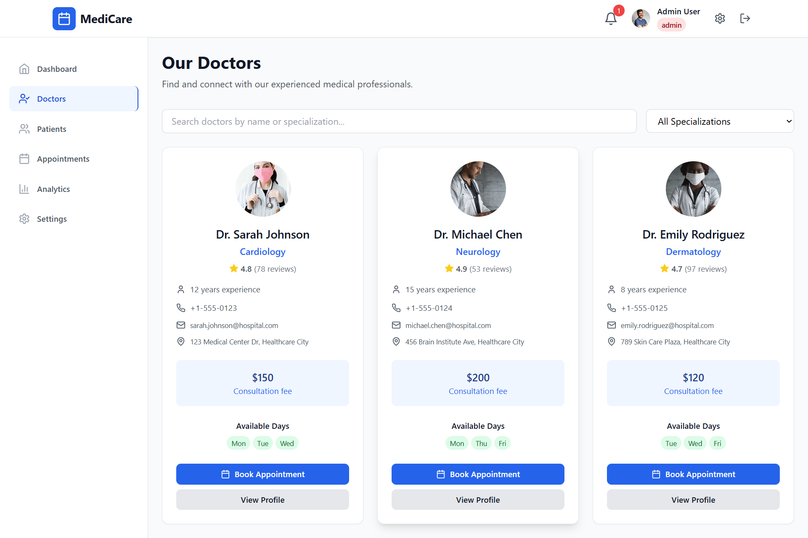
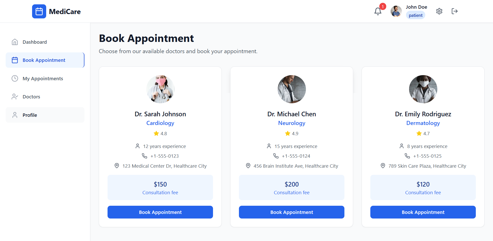
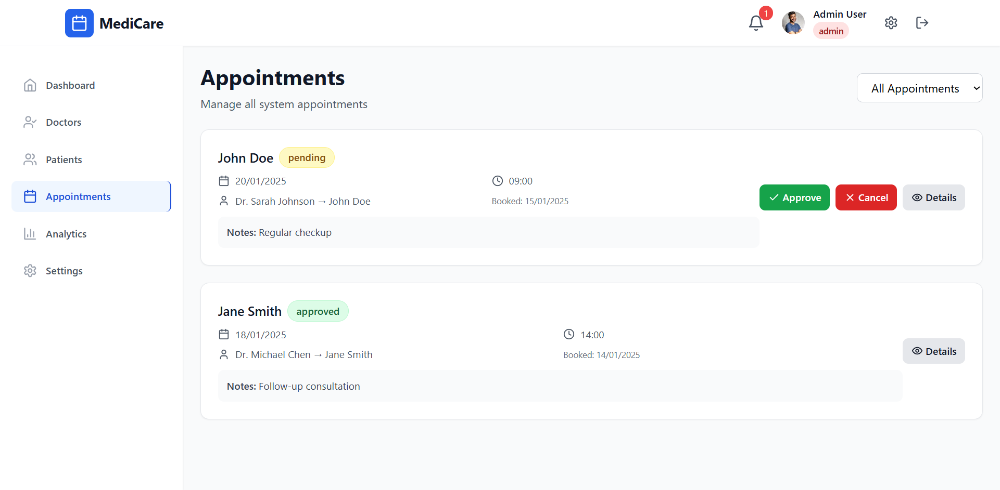

# 🏥 Doctor Appointment System

[](https://reactjs.org/)
[](https://redux-toolkit.js.org/)
[](https://tailwindcss.com/)
[](./LICENSE)

A modern **Doctor Appointment Booking System** built with **React, Redux Toolkit, and TailwindCSS**.  
Patients can easily book appointments, doctors can manage their schedules, and admins can monitor everything via dashboards.

---
## ✨ Key Features

- 📅 **Book & Manage Appointments** in real-time
- 👩‍⚕️ **Doctor Profiles & Scheduling**
- 👤 **Patient Dashboard** for managing bookings
- ⚙️ **Admin Dashboard** for oversight
- 🎨 **Responsive UI** with TailwindCSS
- ⚡ **Global State Management** using Redux Toolkit
- 🔍 **Search & Filter Doctors**
- 💡 **Modern UX with Smooth Animations**

---

## 🚀 Technologies Used

### Frontend

- React.js (Hooks + Functional Components)
- Redux Toolkit (State Management)
- Tailwind CSS (Utility-first Styling)
- React Router DOM (Navigation)
- React Icons / Heroicons (Icons)

### Development Tools

- Vite (Build tool)
- ESLint + Prettier (Code Quality)
- Git & GitHub (Version Control)

---

## 📸 Screenshots  

### 🏠 Home Page  


### 👩‍⚕️ Doctor List  


### 📅 Book Appointment  


### ⚙️ Admin appointment



## 📦 Installation

1. Clone the repository:
   ```bash
   git clone https://github.com/waqas-gul/doctor-appointment-system.git
   cd doctor-appointment-system
   ```
